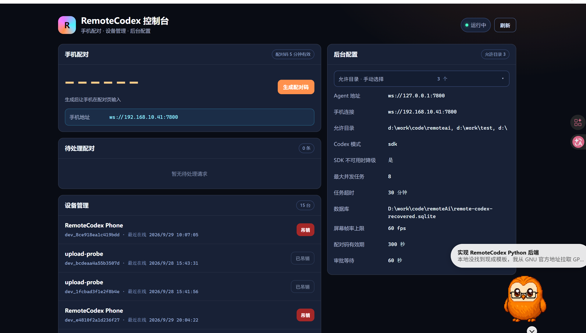
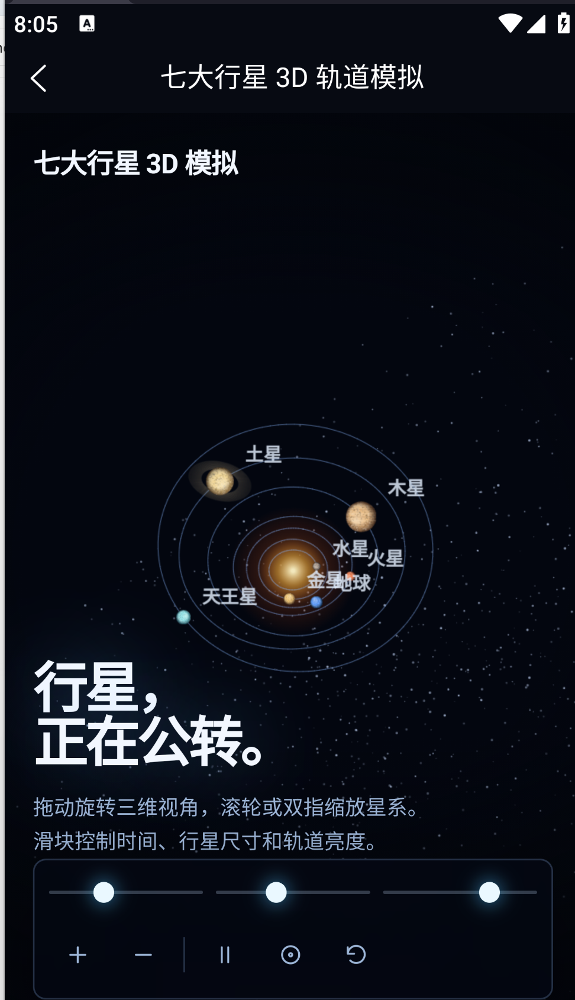

# RemoteCodex uni-app

[English](README.en.md) | [中文](README.md)  
仓库地址：[https://github.com/qmdq/remote-codex-app](https://github.com/qmdq/remote-codex-app)  
配套 PC 后端：[https://github.com/qmdq/remote-codex-backend](https://github.com/qmdq/remote-codex-backend)

RemoteCodex 是一款手机端 Codex Agent 工具，基于 uni-app、Vue 3 和 WebSocket。它在移动设备上实现任务对话、思考/命令/文件编辑时间线、多会话、文件预览/编辑、终端和屏幕控制等 Codex Agent 能力；Codex 调用、命令执行和文件修改不直接发生在手机上，而是通过远程 PC Agent 安全完成。

适合离开电脑时继续跟进 Codex 任务，也能用于局域网内的远程调试、文件检查和演示。

## 能做什么

- **Codex Agent 能力**：发送/中断任务、模型切换、沙箱模式、多会话、历史会话与 PC 聊天记录同步。
- **Codex 风格时间线**：思考、命令、文件编辑和消息按状态展开；Markdown 渲染；断线后按 `seq` 补齐事件。
- **文件工作台**：项目文件浏览、文本/图片/HTML 预览、文本编辑和聊天内图片上传。
- **远程控制**：CPU/内存/磁盘/网络指标、PTY 终端、屏幕订阅、触摸/键盘基础远程输入。
- **连接安全**：6 位配对码申请、PC 端审批、设备 Token 本地保存和自动重连。

## 预览

<div align="center">
  
  
  <br>
  
  
</div>

## 功能

- PC WebSocket 连接、自动重连和设备令牌本地保存
- 6 位配对码申请设备令牌
- 连接页按状态切换「连接 / 断开」，连接成功后不再重复显示连接按钮
- 项目列表、项目创建和项目选择
- 从 Codex 本地 session 自动发现项目，允许目录内可一键导入
- Codex 任务发送、沙箱模式选择和中断
- 模型列表读取自 PC Codex 配置，会话内直接切换
- 同步 Codex 本地 rollout 聊天记录到会话页
- 项目文件浏览、文本带行号预览、图片预览和 HTML WebView 预览
- 聊天输入区选择/拍摄图片，上传后随消息引用给 Codex，气泡内可直接点开预览
- 实时事件时间线，断线后按 `seq` 补齐
- PC CPU / 内存 / 磁盘 / 网络指标
- PC 屏幕画面订阅（后端需安装 `mss` 和 `Pillow`）
- 远程终端，可在已选项目目录内执行命令；Windows 安装 `pywinpty` 后启用完整 PTY

## 运行

1. HBuilderX 打开 `D:\work\code\remoteAi\app-uniapp`
2. 选择「运行到浏览器」或「运行到手机或模拟器」
3. 打开「设备」页；未配对时点「开始配对」，进入独立配对页
4. 填 PC Agent 地址，例如：

   ```text
   ws://192.168.1.20:7800
   ```

5. 在 PC 端生成配对码：

   打开 Agent 启动时输出的 `admin console` 网址，点「生成配对码」。

如果要让手机在局域网直连 PC，先在 PC 上进入后端目录，复制局域网配置模板，再启动后端：

```powershell
Copy-Item config.local.example.json config.mobile.json
.\.venv\Scripts\python.exe -m app serve --config config.mobile.json
```

然后修改 `config.mobile.json` 里的 `projects.allowed_roots` 为你实际授权的目录。该配置监听 `0.0.0.0:7800`；Windows 第一次启动时需要允许 Python 访问专用网络。

6. 回到手机配对页，输入 6 位配对码并请求配对
7. 在 PC 控制台的「待处理配对」里点「批准」。审批通过后 App 自动进入「已配对」，保存 `device_token` 并开始连接。

界面当前按 `Desktop/原型/remoteAi/index.html` 的视觉体系实现：深蓝夜色背景、橙色主操作、conic-gradient 品牌块、连接状态条、可折叠执行卡和大号设备指标。`scripts/generate_icons.py` 可重新生成 tabBar 图标，依赖 Pillow。

## License

GPL-3.0-or-later。商业闭源集成或分发请联系作者取得商业授权。

## 协议约定

与后端保持 `v: 1` envelope：

```json
{
  "v": 1,
  "id": "request-id",
  "type": "turn.start",
  "payload": {
    "project_id": "prj_xxx",
    "prompt": "Fix the failing test",
    "sandbox": "workspace_write"
  }
}
```

项目页的「同步」会读取 PC 端 `CODEX_HOME/sessions` 中的 `cwd`，调用：

* `codex.project.list`：发现 Codex 使用过的工作目录，返回最近使用时间、会话数和是否允许导入
* `codex.project.import`：将允许目录内的工作目录登记到 Agent 项目列表；重复导入会复用已有项目

事件消息使用 `codex.event` / `agent.event`，前端按 `seq` 去重；重连或切换项目后调用 `event.replay` 恢复时间线。
